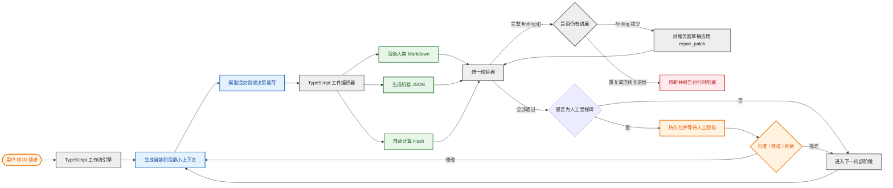
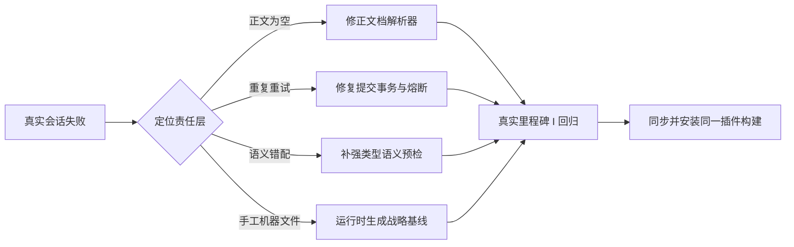

# DDD 工作流成本失控问题与改造方案

## 1. 文档目的

本文记录一次真实 Mobile Coder DDD 新增功能运行中发现的成本与产出失配问题，并将问题证据、根因、解决方案和实施验收条件建立一一对应关系。后续实现以本文的“实施合同”为唯一依据。

本次分析对象为：

- 项目：`E:\zzh\CMintern\DDD-practice\hmdp-mobilecoder`
- 工作流：`add-feature/user-shop-visit-trail`
- 会话：`ses_000bc91ffffebdlvCQmRmOKPJV`
- 目标：完成现状恢复和 Big Picture EventStorming，形成里程碑 I 人工验收文档

## 2. 问题发现

### 2.1 成本证据

| 指标 | 实际结果 |
|---|---:|
| 模型调用 | 136 次 |
| 工具调用 | 166 次 |
| 文件读取 | 60 次 |
| 搜索 | 20 次 |
| 文件编辑或写入 | 36 次 |
| Shell 调用 | 24 次 |
| Checkpoint 尝试 | 15 次 |
| Checkpoint 成功 | 0 次 |
| 总处理 Token | 20,055,125 |
| 非缓存输入加输出 Token | 764,117 |
| 缓存读取占比 | 96.19% |
| 会话记录成本 | 约 6.54 美元 |

15 次 Checkpoint 中有 13 次使用相同参数，另有 9 次重复执行相同的 SHA-256 命令。会话后期每次模型调用接近 20 万 Token。

### 2.2 产出证据

高成本没有形成对应的业务增量：

- 工作流状态仍为 `currentStage=00-request`；
- 只有 `checkpoint-001`；
- 里程碑 I 状态仍为“未到达”；
- 正式战略事件风暴章节仍为占位内容；
- `01-current-evidence` 候选稿没有通过 Checkpoint；
- 没有形成可供人类验收的 Big Picture EventStorming。

候选稿还出现阶段越界和语义矛盾：

- 在现状证据阶段决定包结构、独立表、Redis Key 和回滚实现；
- 一方面把 `queryShopById` 定义成“光顾入口”，另一方面又把“光顾定义”列为未决问题；
- 收集了 Follow、Blog 等与本次轨迹功能无直接关系的细节；
- 用大量机器合同内容挤占真正的业务事件发现。

## 3. 从问题到根因再到方案

| 问题 | 根因 | 解决方案 | 验收方式 |
|---|---|---|---|
| Checkpoint 连续失败 15 次 | 校验器发现首个问题就抛错 | 校验器累积并一次返回全部 `findings[]` | 一个无效阶段包只触发一次完整校验报告 |
| 修改一个文件导致多个文件失效 | 模型手工维护 Markdown、stage-output、scope-review 和 Hash | TypeScript 工件编译器统一生成和绑定 | 正常工作流中模型不调用 SHA 命令，不直接写机器工件 |
| 相同参数反复提交 | 无失败指纹和进展判定 | 保存服务器端草稿、失败指纹、最佳 finding 数和无进展次数 | 相同失败连续两次或连续两次无进展才熔断；持续减少 finding 时允许修复 |
| 修复一个字段时删除另一个正确字段 | 每次失败后都由模型重建完整 payload | 首次提交完整 `submission`，后续只提交 `repair_patch` | 修复 `itemRefs` 后原 `statement` 仍被保留 |
| 为发现 JSON 字段读取多个大文件 | 工具参数是 `record<string, any>`，精确类型只存在于实现代码 | 工具暴露强类型 Zod Schema，Prepare 返回完整字段合同、合法前缀、延期目标和最小示例 | 模型无需读取完整 profile、intrinsic catalog 和 legacy contract |
| 136 次模型调用 | 每个文件操作都经过一次或多次模型推理 | 用任务级复合工具替代文件级原子编排 | 到达里程碑 I 的模型轮次控制在低两位数以内 |
| 上下文膨胀至约 20 万 Token | 全量工具定义、Skills、历史工具结果持续进入会话 | 阶段最小上下文投影、结果摘要、动态工具裁剪 | 每轮只包含当前阶段合同和相关证据摘要 |
| 01 阶段写入战术和交付决定 | 阶段输入输出合同虽然严格，但实际产物仍由模型自由书写 | 运行时按阶段拒绝非本阶段决策，Markdown 由结构化事实渲染 | 01 只包含现状行为、兼容约束、历史决定和未决问题 |
| 同一个模型自写自审 | Scope Review 只是形式上的独立 | 结构校验和确定性语义校验由程序完成；必要的模型审查使用隔离上下文 | Review 不继承候选生成过程中的冗长工具历史 |
| Checkpoint 被当作调试器 | 缺少无副作用的预校验动作 | `prepare/validate` 与 `checkpoint` 分离 | Checkpoint 只接受已经验证通过的阶段包 |
| Checkpoint 后又调用 status | 两个结果重复携带相同 transition | Checkpoint 返回完整权威 transition；仅恢复或人工查询时调用 status | 正常阶段提交后不再强制追加 status 调用 |

## 4. 目标架构



图中职责边界是本次改造的核心：

- 模型负责领域分析、备选方案和建议；
- TypeScript 负责格式、同步、Hash、状态、校验和重试；
- Markdown 是人类验收工件；
- JSON 是运行时工件，不要求人类或模型手工维护；
- 只有六个罗马数字里程碑需要人工停机。

## 5. 新的阶段执行合同

### 5.1 Prepare

运行时根据工作流类型和阶段生成 `StagePreparation`：

```ts
interface StagePreparation {
  workflowType: string
  workflowId: string
  stageId: string
  governingQuestion: string
  allowedDecisions: string[]
  forbiddenDecisions: string[]
  approvedInputs: unknown[]
  relevantEvidence: unknown[]
  requiredSections: string[]
  submissionSchema: object
  budget: {
    maxModelTurns: number
    maxValidationAttempts: number
  }
}
```

Prepare 不把历史完整对话、无关 Skill 和所有代码文件返回给模型。

### 5.2 Submit

模型只提交阶段领域载荷：

```ts
interface StageSubmission {
  inputReferences: string[]
  items: DomainItem[]
  relations?: DomainRelation[]
  deferredItems?: DeferredItem[]
  soleOutput: { statement: string; itemRefs: string[] }
  sections: Record<string, string>
  overview?: HumanGateOverview
}
```

运行时随后在一个事务中：

1. 校验提交载荷；
2. 生成 `stage-output.json`；
3. 渲染候选 Markdown 的 owned sections；
4. 生成确定性 Scope Review；
5. 计算并绑定 Hash；
6. 执行全量结构与语义校验；
7. 通过时发布 Checkpoint；
8. 返回完整 transition。

### 5.3 Validate

校验不得以首错中断。结构错误、阶段归属错误、语义图错误、Markdown 映射错误和 Hash 错误必须在一次报告中返回。

校验失败不增加 Checkpoint，也不修改正式罗马数字文档。

### 5.4 Retry 与熔断

每个失败阶段持久化服务器端 `submission-draft.json`，并记录：

- 当前失败数量与历史最佳失败数量；
- 最后一次失败指纹和相同失败次数；
- 连续无进展次数和本次进展状态；
- 最近一次完整合法草稿。

默认策略：

- 第一次使用强类型 `submission`；
- 失败后只允许用 JSON Patch 修复草稿，不得重建完整 payload；
- finding 数下降表示仍有进展，不按累计次数熔断；
- 相同失败连续两次、连续两次无进展或六次仍未完成时熔断；
- 达到熔断条件后 `stopAllowed=true`；
- `requiredAction=runtime-contract-repair`；
- 人类收到业务影响和运行时问题摘要，而不是内部堆栈。

## 6. 到达里程碑 I 的目标调用链

```text
ddd_workflow_init
→ ddd_workflow_prepare_stage(01-current-evidence)
→ ddd_workflow_submit_stage(01-current-evidence)
→ ddd_workflow_prepare_stage(02-big-picture-event-storm)
→ ddd_workflow_submit_stage(02-big-picture-event-storm)
→ 里程碑 I 人工验收
```

以下调用不得再出现在正常路径：

- 模型执行 SHA-256；
- 模型直接创建或修复 `scope-review.json`；
- 模型为满足格式反复编辑同一 Markdown；
- 相同参数连续调用 Checkpoint；
- Checkpoint 成功后无条件再调用 status；
- 在步骤 01 加载战术设计和 Coding Skills。

## 7. 实施顺序

### P0：阻止成本失控

1. 把校验器改为完整 findings 收集；
2. 增加失败指纹和三次熔断；
3. Checkpoint 返回完整 transition 后取消强制 status；
4. 阻止相同参数重复 Checkpoint；
5. 增加成本遥测和阶段预算字段。

### P1：把机器工作迁移到 TypeScript

1. 增加 `prepare_stage`；
2. 增加 `submit_stage`；
3. 自动生成机器工件和 Hash；
4. 自动渲染 Markdown owned sections；
5. 保留旧原子工具作为兼容入口，但不再作为 Slash 主路径。

### P2：压缩上下文

1. 每阶段只加载相关合同与证据摘要；
2. 工具结果默认分页、截断和引用化；
3. 评估 OpenCode V2 `session.hook("request")` 动态裁剪工具；
4. 在阶段边界清理过期工具结果，只保留批准摘要。

## 8. 验收指标

### 功能正确性

- 三条工作流仍互斥路由；
- 六个人工里程碑保持不变；
- 01 结束不能宣称里程碑 I；
- 02 通过后才能提交里程碑 I；
- OpenSpec change、Git 与最终归档规则保持不变；
- 历史 `workflow-state.json` 可以读取和迁移。

### 效率

- 正常阶段不调用 Shell 计算 Hash；
- 一个无效提交一次返回全部问题；
- 同阶段最多三次校验失败；
- 相同失败不会自动重复；
- 到达里程碑 I 的模型调用为个位数或低两位数；
- 工具结果不会无限累积到后续阶段上下文。

### 业务质量

- 人工文档只呈现当前里程碑的业务问题；
- 战略阶段不出现聚合、表、索引、Controller 或代码路径决定；
- 战术阶段不重新划分战略边界；
- Coding 不隐式改变批准的业务语义；
- 未决问题不能进入主流程或本次目标结论。

## 9. 参考依据

- [OpenCode Custom Tools](https://opencode.ai/docs/custom-tools/)
- [OpenCode V2 Plugins](https://opencode.ai/v2/docs/build/plugins)
- [Ajv Validation Options](https://ajv.js.org/options)
- [OpenAI: A Practical Guide to Building Agents](https://openai.com/business/guides-and-resources/a-practical-guide-to-building-ai-agents/)
- [OpenAI Agents SDK: Running Agents](https://openai.github.io/openai-agents-js/guides/running-agents/)
- [Anthropic: Effective Context Engineering](https://www.anthropic.com/engineering/effective-context-engineering-for-ai-agents)
- [Anthropic: Advanced Tool Use](https://www.anthropic.com/engineering/advanced-tool-use)
- [LangGraph Fault Tolerance](https://docs.langchain.com/oss/python/langgraph/fault-tolerance)
- [LangGraph Interrupts](https://docs.langchain.com/oss/python/langgraph/interrupts)
- [OpenSpec Concepts](https://github.com/Fission-AI/OpenSpec/blob/main/docs/concepts.md)

## 10. 压缩后的实施清单

后续实现只保留以下七条：

1. 模型只提交领域载荷，不手工维护机器工件；
2. TypeScript 在一个事务中渲染 Markdown、生成 JSON、计算 Hash；
3. 校验一次返回全部 findings；
4. 服务器保存提交草稿；失败后只做增量 Patch，重复或连续无进展才熔断；
5. Checkpoint 自带 transition，正常路径不追加 status；
6. 每阶段只加载当前合同和相关证据；
7. 三条工作流、六个人工里程碑、OpenSpec 生命周期保持不变。

## 11. 本轮实施结果

本轮已经完成 P0 和 P1 的核心改造，并落实了 P2 的阶段最小合同入口：

- 新增 `ddd_workflow_prepare_stage`，只返回当前阶段的内禀问题、允许结果、语义政策、所拥有章节和唯一输出；
- 新增 `ddd_workflow_submit_stage`，接收一次领域提交并由 TypeScript 自动生成候选 Markdown、`stage-output.json`、`scope-review.json` 和 SHA-256；
- 新增批量预检，一次返回全部结构、Scope、语义关系和阶段越界问题；
- 新增失败指纹、最佳 finding 数和无进展计数。同一失败连续两次、连续两次无进展或六次仍未完成时进入 `runtime-contract-repair`；finding 持续减少时不误熔断；
- 成功提交直接返回 checkpoint 与 transition，Slash 主路径不再额外调用 status；
- 旧 `begin_stage` 与 `checkpoint` 仅作为历史未完成 workbench 的兼容入口；
- 新增真实端到端测试，覆盖批量 findings、重复失败熔断、修复后恢复、自动工件编译和阶段 01 后继续执行；
- 四个总控 Skill 已通过 Skill Creator 的 `quick_validate.py`；插件构建、12 项测试、资源同步和 npm 打包检查全部通过；
- `2.1.0` 构建已经全局安装到 OpenCode 与 Mobile Coder，两端均加载 11 个 TypeScript 工具，安装产物 hash 与源码构建一致。

仍可继续演进的 P2 项是宿主级上下文分页、工具结果回收和会话成本遥测。它们不影响本轮主路径正确性，但可以在取得新一轮真实会话数据后继续优化。

## 12. Mobile/Bun 运行时故障与 2.1.1 修复

2026-08-15 的后续真实会话在 272 秒内发生 25 次模型调用，累计处理约 122.8 万 Token，但没有完成工作流初始化。模型在两次初始化失败后执行了 17 次 Shell 调用，包括 `npx`、全局安装、PATH 探测和手工 change 清理，最终由用户中止。

根因不是领域模型或 OpenSpec 缺失，而是插件使用 `process.execPath` 启动 OpenSpec。Node 测试中该值是 `node.exe`，Mobile Coder 的 Bun 独立宿主中却是 `mobile-bin.exe`，所以插件实际把 OpenSpec 脚本交给了 Mobile 主程序。

2.1.1 已完成以下修复：

- 独立解析 OpenSpec 所需的真实 Node 可执行文件，不再把宿主进程等同于 Node；
- OpenSpec 启动或 JSON 协议失败时返回 `ddd-runtime-error/v1`，并设置 `retryableByModel=false`、`runtime-contract-repair` 和 `stopAllowed=true`；
- Slash 与三个总控工作流明确禁止在该错误后使用 Bash、`npx`、全局安装或手工 OpenSpec 目录操作恢复；
- 安装器自动同步全部 11 个 DDD 工具权限，包括 `prepare_stage`、`submit_stage`、review、archive 与 OpenSpec action；
- `ddd-orchestrate` 从约 30 KB 压缩到约 5.7 KB，`ddd-deliver-feature` 从约 20 KB 压缩到约 5.9 KB；三条主线不再要求启动时读取完整的 49 KB Profile；
- `ddd_environment_doctor` 现在实际执行内置 OpenSpec 的版本检查，而不是只输出静态环境信息；
- 新增 Node 单元回归和 Bun 宿主集成验证。14 项测试、资源一致性、打包检查和 Bun 下的真实工作流初始化全部通过；
- 2.1.1 已全局安装到 Mobile Coder 与 OpenCode。两端均为 19 个 Skills、11 个工具权限、0 个资源 Hash 不一致，且不依赖 Python。

修复后的正常初始化路径重新收敛为一次工具调用。若宿主缺少可用 Node，模型会收到可解释、可停止的运行时合同，而不是进入高成本的试错循环。

## 13. 阶段提交错配与 2.1.2 修复

同日另一条真实会话正确完成路由和初始化，却在 `01-current-evidence` 连续三次提交失败。finding 数从 184 降到 43，再降到 1，说明模型一直在修复；旧策略仍因累计三次失败而熔断。最后一次失败还暴露出更具体的问题：第二次载荷已有 `soleOutput.statement`，第三次为了补 `itemRefs` 重建了整个对象，反而删除了已经正确的 `statement`。

这次故障由三类因素共同造成：

- 工具把 `submission` 暴露为任意对象，精确 TypeScript 类型没有进入模型可见的工具 Schema；
- Prepare 没给出完整字段、证据前缀、延期目标和最小合法示例，迫使模型读取大体积内部合同猜格式；
- 模型对长上下文中的字段保持能力有限，整对象重写时容易产生“修 A 坏 B”。

2.1.2 将可靠性边界从提示词移入运行时：

- `ddd_workflow_submit_stage` 使用强类型 Zod Schema，缺少 `statement` 或 `itemRefs` 会在工具边界直接暴露；
- Prepare 一次返回完整输出合同、所需 Skills、证据前缀、合法延期阶段和最小合法示例；
- 第一次提交保存 `submission-draft.json`，后续只接受 `repair_patch`，未涉及字段由运行时保留；
- 熔断依据失败是否重复和是否持续无进展，而不是简单累计次数；
- Slash 和总控 Skills 明确禁止为猜字段读取完整 Profile、Intrinsic Catalog 或旧 Artifact Contract；
- 新增真实故障链回归，验证缺 `itemRefs`、修补时暂时缺 `statement`、最终增量修复的全过程不会丢失草稿字段。

2.1.2 已通过 15 项测试、TypeScript 构建、资源一致性检查和 npm 打包检查，并全局安装到 Mobile Coder 与 OpenCode。两端加载验证均确认存在 `repair_patch`，且强类型 Schema 会拒绝缺失 `itemRefs` 的提交。

## 14. 里程碑发布循环与 2.1.3 修复

最新真实会话完成了阶段 01，却在战略事件风暴的里程碑 I 发布前反复修补同一个错误。候选文档已经包含完整的一页结论，运行时仍报告“当前结论为空”。同时，每次编译失败都显示为第一次失败，因此重复错误没有熔断。会话还暴露出战略基线需要模型手工创建、全局语义枚举未校验，以及未决业务问题仍能进入主流程等问题。

根因位于运行时合同，而不是单纯的模型能力：正文提取正则在多行模式下把标题行尾误当成全文结尾；提交事务在编译完成前清空了失败历史；预检没有覆盖阶段质量合同和全局事件风暴语义；战略基线只有校验器，没有与强类型提交相连的生成入口。

2.1.3 按“模型提交业务判断，运行时生成和验证机器工件”的边界完成修复：

- 修正里程碑小节替换与读取规则，并用真正到达里程碑 I 的端到端测试验证发布和人工停机信号；
- 编译成功前不再清空失败历史；预检通过后的编译失败直接标记为不可由模型重试的运行时合同错误；
- 在预检中一次返回质量合同、固定目录、全局 `scopeDisposition`/`flowRole`、能力状态一致性和未决问题阻塞等 findings；
- Prepare 返回 OpenSpec 战略库存，AI 只在强类型 `strategicBaseline` 字段中逐项判断，TypeScript 负责哈希和 `.ddd/strategic-baseline.json`；
- 新会话恢复已有草稿时，Prepare 会重新预检并直接返回完整 findings，不要求模型重读仓库或重建载荷；
- 新增真实故障回归，覆盖里程碑正文解析、战略基线生成、事件风暴语义错配和完整里程碑 I 发布。



## 15. 六里程碑轻量执行与 2.2.0

2.1.3 已经解决了无效重试，但默认调度仍按每个内部阶段分别执行 Prepare 和 Submit。完整性来自阶段合同和人工里程碑，工具调用次数本身不创造额外质量。因此 2.2.0 不删除任何 DDD 阶段，而是在运行时增加“执行到下一个人工里程碑”的线性批次：

- `prepare_milestone` 一次返回到下一个人工关卡为止的有序阶段合同，并把重复的证据前缀、语义枚举和修复协议提升为共享合同；
- AI 在一次推理中完成同一里程碑内的多个专业分析，但每份提交仍保留自己的 governing question、Skills、Scope、items、relations 和 sole output；
- `submit_milestone` 按顺序逐阶段编译、校验和持久化，仍产生独立 checkpoint、Scope Review、增量和正式里程碑文档；
- 批次中途失败时保留已经成功的 checkpoint，只重新准备失败阶段和剩余阶段；
- Design-Level EventStorming 与战术设计之间的人工关卡、每个实现切片的测试和 Git 提交、显式回溯与多上下文战术循环继续使用单阶段工具，不能批量跳过。

默认分析与设计调用由“每个内部阶段两次工具调用”变为“每个人工里程碑两次工具调用”。首个里程碑中，新增功能和新系统由 4 次降为 2 次，重构由 6 次降为 2 次；创建系统的战略设计由 8 次降为 2 次。六个人工里程碑、三条互斥路由、阶段专业边界、OpenSpec 生命周期、实现证据和最终验收条件均保持不变。

## 16. 模型工具面缩减与 3.0.0

2.2.0 减少了运行时往返次数，但 OpenCode 仍会把全部模型可见工具的名称、说明和参数 Schema 注入每轮上下文。旧版暴露 13 个 DDD 工具，其中里程碑与单阶段的 Prepare/Submit 各自重复声明，诊断、迁移、底层 checkpoint 等管理能力也占用模型工具面。它们不会让领域分析更完整，却会持续增加输入 Token，并提高模型选错相似工具的概率。

3.0.0 采用“统一操作协议、Schema 复用、管理面与执行面分离”进行缩减：

- 将 `prepare_milestone` 与 `prepare_stage` 合并为 `ddd_workflow_prepare`，通过 `mode=milestone|stage` 区分执行粒度；
- 将 `submit_milestone` 与 `submit_stage` 合并为 `ddd_workflow_submit`，强类型 `StageSubmission` 只向模型声明一次；
- 将 environment doctor、begin stage、底层 checkpoint 和 layout migration 移入 `dddWorkflowAdmin` 管理 API，不再作为模型可选工具；
- 安装器自动删除旧工具权限，只保留 7 个当前工具，避免升级后新旧工具同时出现；
- 用自动化预算测试固定工具数量和 Schema 上限，防止后续迭代重新膨胀。

按 OpenCode 实际注册的工具名称、说明和 JSON Schema 计算，模型可见工具从 13 个降为 7 个，字符载荷从 19,395 降为 10,225。按 4 字符约等于 1 Token 的工程估算，工具注入约从 4,849 Token/轮降为 2,557 Token/轮，下降 47.3%。该数字是工具定义的静态估算，不等同于模型供应商账单中的精确 tokenizer 计数。

本次缩减没有删除 DDD 阶段。三条互斥工作流、六个人工里程碑、战略与战术事件风暴、OpenSpec 生命周期、纵向切片、测试、Git 提交与实现证据仍由同一个 TypeScript 状态机和原有阶段合同校验。变化只发生在模型与插件之间的调用接口，属于协议压缩，不是流程裁剪。

## 17. 正式里程碑文档受控发布与 3.0.1

此前正式里程碑文档依靠 Checkpoint 发布前的 SHA-256 检测发现绕过工作流的修改。该校验能够覆盖外部编辑器、Shell、其他进程和并发变化，但属于发布边界的事后验真，不能提前阻止模型通过内置文件工具误改文档。

3.0.1 增加“事前禁止、受控发布、边界验真”三层保护：

- `config` Hook 为活动、归档和遗留布局中的六类罗马里程碑文档追加路径级 `edit: deny`，覆盖 OpenCode 的 `write`、`edit` 和 `apply_patch`；
- `tool.execute.before` 再次解析单文件、批量编辑和 Patch 目标，命中正式或候选里程碑文档时返回 `DDD_MILESTONE_DOCUMENT_PROTECTED`；
- LLM 始终不获得正式文档直写能力，只提交强类型领域判断；`ddd_workflow_submit` 与 `ddd_workflow_review` 在状态、结构、语义和证据校验通过后由 TypeScript 运行时原子发布；
- 普通生产代码和测试文件仍可编辑，Coding 阶段不受影响；
- SHA-256 继续保留在 Checkpoint 边界，用于发现 Hook 无法覆盖的 Shell、IDE、Git、其他进程和并发修改。

该改动主要提升正确性和权限边界清晰度，不以减少 Hash 计算作为性能优化目标。22 项自动化测试覆盖路径规则合并、活动/归档/遗留里程碑拒绝、普通代码编辑放行和受控发布不受影响。
